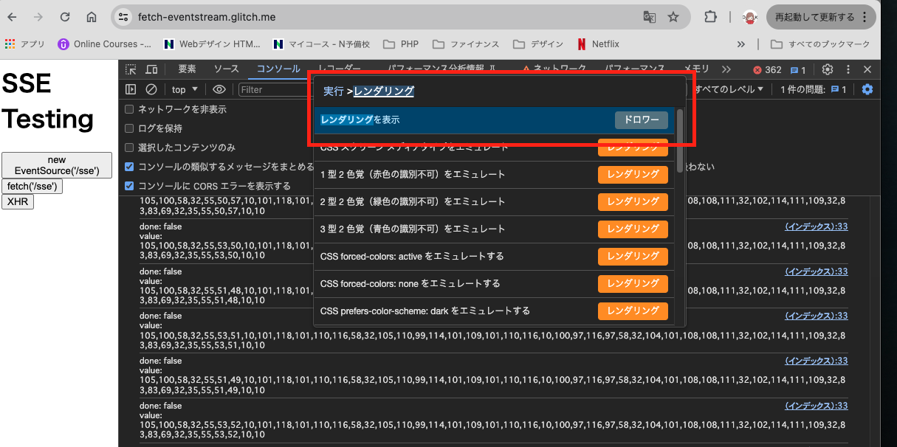

レンダリングタブのリファレンスを読んで、初めて知った知識や気になったことを雑にメモしていく
https://developer.chrome.com/docs/devtools/network/reference?hl=ja

## 概要

レンダリングタブで出来ること

- レンダリングパフォーマンスの問題を確認できる。
- 再ペイント、レイアウトシフト、レイヤとタイル、スクロールに関する問題を特定し、レンダリングの統計情報や Core Web vitals を確認できる。
- CSS メディア機能をエミュレートする。
- コードやテスト環境で手動で指定しなくても、CSS がページでどのようにレンダリングされるかをテストできる。
- その他
- 広告フレームのハイライト表示、ページへのフォーマスのエミュレート、
  ローカルのフォントや画像形式の無効化、自動ダークモードの有効化、視覚障がいのエミュレートが可能。

## レンタリングタブの開き方

レンダリングタブを開くには

1. DevTools を開く
2. Command + Sfit + P(Mac) を押下しコマンドメニューを開く
3. 「rendering」と入力し、「レンダリングを表示」 を選択して、Enter キーを押すと、DevTools ウィンドウの下部に 「Rendering」 タブが表示される。
   

## レンダリングパフォーマンスに関する問題を検出する

### ペイント 点滅で再ペイントされた領域をハイライトする

デモ : https://googlechrome.github.io/devtools-samples/jank/
このオプションをオンにすると、再ペイントが行われるたびに Chrome で画面が緑色で点滅します。

再ペイントされている領域を表示するには:

1. デモページにアクセスし、 「レンダリング」 タブを開き、「ペイントフラッシュ」 をオンにします。
2. 緑色でハイライト表示された再ペイントを確認します。

別のページで画面全体が緑色で点滅したり、ペイントするべきではないと思う画面領域が表示された場合は、さらに調査することを検討してください。

### レイアウト シフト領域をハイライト表示する

「レイヤの枠線」を使用すると、レイヤの枠線とタイルをページの上部に重ねて表示できます。

レイヤの枠線を有効にするには、

1. 「レンダリング]」タブを開き、「レイヤの枠線」 チェックボックスをオンにします。
2. レイヤの枠線はオレンジ色とオリーブ色、タイルはシアン色になります。

### フレームレンダリングを使用して 1 秒あたりのフレーム数をリアルタイムで表示する

「Frame render stats」 を開くには、

1. 「レンダリング」タブを開き、[フレーム レンダリングの統計情報] チェックボックスをオンにします。
2. ページの右上にある統計情報を確認します。

「Frame render stats」 オーバーレイには、次の情報が表示されます。

- ページが実行される際の 1 秒あたりのフレーム数をリアルタイムで推定します。
- 次の 3 つのフレームタイプを使用して、タイムラインをプロットとしてフレーム化します。
  - 正常にレンダリングされたフレーム（青い線）
  - 部分的に表示されたフレーム（黄色の線）
  - フレーム落ち（赤い線）。
- GPU ラスターの状態: オンまたはオフ。詳細については、GPU ラスターの取得方法をご覧ください。
- GPU メモリ使用量: メモリの使用済み MB 数と最大 MB 数。

### スクロールのパフォーマンスに関する問題を特定する

「スクロールのパフォーマンスに関する問題]」を使用して、ページのパフォーマンスを低下させる可能性のあるスクロールに関連するイベント リスナーがあるページの要素を特定します。

- 問題がある可能性のある要素を確認するには、

1. 「レンダリング」タブを開いて、「スクロールのパフォーマンスに関する問題」 をオンにします。
2. 問題のある可能性がある要素がハイライト表示されていることを確認します。
